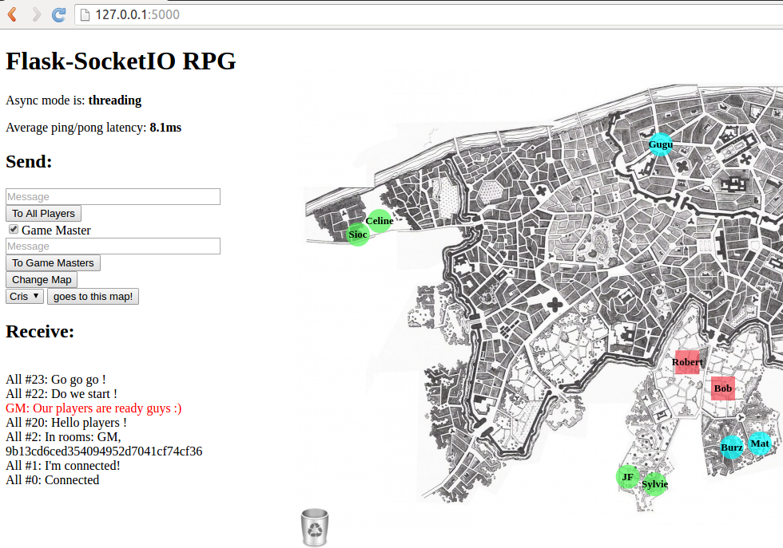

Flask-SocketIO RPG
==================

A RPG board for helping mastering a RPG Game. It provides:

- a chat room for broadcasting messages
- a chat romm for Game Masters for discussing private stuff
- a multi map with player and NPC positions

Server is implemented in python 3. Client is web based.

Implemented with Socket.IO integration for Flask applications.

Installation
------------

You can install the requirements as usual with pip:

    pip install flask-socketio

Usage
-----

On server side:

    cd app
    python app.py

On client side:

    Go to http://127.0.0.1:5000/

Configuration
-------------

Players and NPC can be configured in data.json. There are two entries:

- players: list the full set of players with the type (player1, player2, npc)
- coord: list a partial list of the coordinates of players (x, y, zmap (the map number))

The configuration is regularly savec in data-save.json. When launched again, the data-save.json file is read instead of the initial data.json file.
   

Resources
---------

- [Tutorial](http://blog.miguelgrinberg.com/post/easy-websockets-with-flask-and-gevent)
- [Documentation](http://pythonhosted.org/Flask-SocketIO)
- [PyPI](https://pypi.python.org/pypi/Flask-SocketIO)
- [CanvasDragging](http://rectangleworld.com/blog/archives/129)
